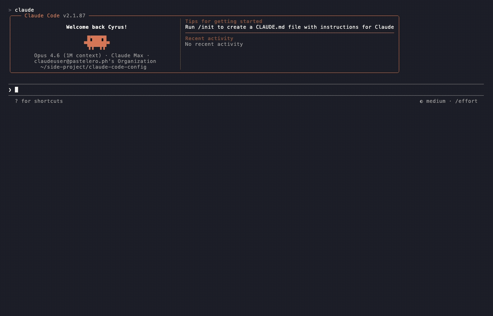
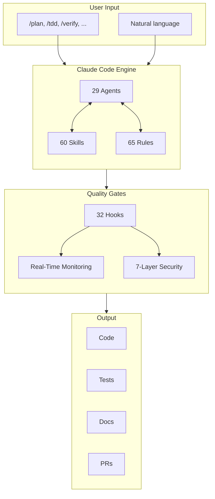
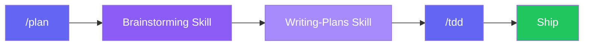
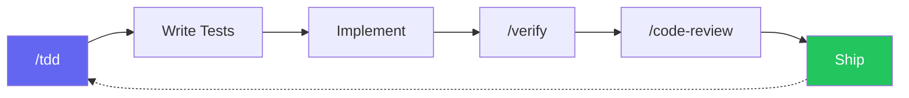
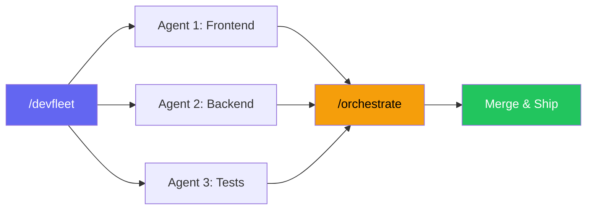
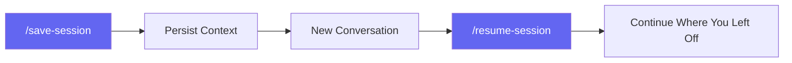
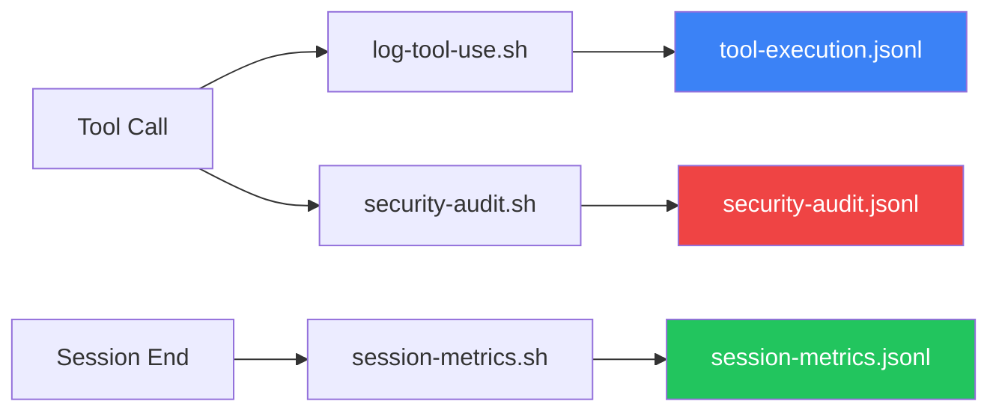

<div align="center">

# Claude Code Config

**Production-ready Claude Code configuration for rapid app development.**

[](LICENSE)
[](agents/)
[](commands/)
[](skills/)
[](rules/)
[](security/SECURITY.md)

29 agents, 60 commands, 60 skills, 65 rules, 7-layer security, real-time monitoring — ready to use.

Built on [everything-claude-code](https://github.com/affaan-m/everything-claude-code) + [obra/superpowers](https://github.com/obra/superpowers).

</div>

---

## Why This Exists

Claude Code is powerful out of the box, but configuring it for real production work — agents, slash commands, TDD workflows, security, monitoring — takes hours of setup and experimentation.

This repo gives you a **battle-tested configuration** so you can skip the setup and start building:

- **Idea to app in one session** — brainstorm, plan, TDD, review, ship
- **Multi-language support** — TypeScript, Python, Go, Rust, Kotlin, Java, C++, Swift, PHP, C#, Perl
- **Security by default** — 8-layer protection based on OWASP Agentic Top 10
- **Real-time visibility** — every tool call logged, security events audited

---

## Demo

### Install


### Planning with `/plan`


### TDD Workflow with `/tdd`



---

## Quick Start

```bash
git clone https://github.com/Cyvid7-Darus10/claude-code-config.git
cd claude-code-config
./install.sh
```

Restart Claude Code, then try `/plan` or `/tdd`.

---

## What's Inside

| Component | Count | Highlights |
|-----------|-------|------------|
| **Agents** | 29 | `planner`, `architect`, `code-reviewer`, `security-reviewer`, `tdd-guide`, `typescript-reviewer`, `build-error-resolver`, language-specific reviewers |
| **Commands** | 60 | `/plan`, `/tdd`, `/verify`, `/code-review`, `/save-session`, `/resume-session`, `/devfleet`, `/orchestrate`, `/brainstorm` |
| **Skills** | 60 | Brainstorming, writing-plans, executing-plans, git-worktrees, TDD, systematic-debugging, strategic-compact, continuous-learning |
| **Rules** | 65 | Coding standards, patterns, security, testing — common + TypeScript, Swift, Python, Go, Rust, Kotlin, Java, C++, PHP, C#, Perl |
| **Hooks** | 32 | Quality gates, auto-format, type-checking, git push reminders, session persistence, cost tracking, security audit, monitoring |
| **Security** | 7-layer | Deny lists, sandboxing, sanitization, prompt injection defense, supply chain protection, credential protection, observability |
| **Monitoring** | 3 hooks | Tool execution logging, security auditing, session metrics |
| **MCP** | 1 | GitHub MCP server (manage repos, PRs, issues via conversation) |
| **Sounds** | 3 | Notification sounds for task completion (macOS) |

---

## Architecture



---

## Key Workflows

### Idea to App



### Development Loop



### Multi-Agent



### Session Management



---

## 7-Layer Security

Production-grade security based on [OWASP Agentic Top 10](https://genai.owasp.org/resource/owasp-top-10-for-agentic-applications-for-2026/):

| Layer | Protection | What It Does |
|:-----:|------------|--------------|
| 1 | **Attack Surface** | Minimize access points, restrict `allowedTools` |
| 2 | **Sandboxing** | Path-based deny lists for `~/.ssh`, `~/.aws`, credentials |
| 3 | **Sanitization** | Audit external links, detect hidden text |
| 4 | **Prompt Injection** | Block malicious skills, rules, hooks, CLAUDE.md |
| 5 | **Supply Chain** | Pin MCP versions, verify packages |
| 6 | **Credentials** | Separate agent accounts, block env harvesting |
| 7 | **Observability** | Real-time monitoring, security audit logs |

```bash
# Quick security scan
npx ecc-agentshield scan
```

See [security/SECURITY.md](security/SECURITY.md) for the full guide.

---

## Real-Time Monitoring

Track all agent activity with structured JSONL logs:

```bash
# Live tool execution log
tail -f ~/.claude/logs/tool-execution.jsonl | jq

# Live security alerts
tail -f ~/.claude/logs/security-audit.jsonl | jq

# Session summary metrics
cat ~/.claude/logs/session-metrics.jsonl | jq
```



See [monitoring/README.md](monitoring/README.md) for dashboard setup.

---

## Selective Install

Install only what you need:

```bash
./install.sh agents skills          # Just agents and skills
./install.sh commands               # Just slash commands
./install.sh security monitoring    # Just security and monitoring
./install.sh --dry-run              # Preview what would be installed
./install.sh --uninstall            # Remove everything
./install.sh --uninstall skills     # Remove only skills
```

Available components: `agents`, `commands`, `skills`, `rules`, `hooks`, `sounds`, `mcp`, `security`, `monitoring`

---

## MCP Servers

Pre-configured MCP servers are installed to `~/.claude/mcp.json`:

| MCP | What it does | Setup |
|-----|-------------|-------|
| **context7** | Live docs lookup for any library | None — works immediately |
| **playwright** | Browser automation & testing | None — works immediately |
| **magic** | Magic UI components for React | None — works immediately |
| **github** | Manage repos, PRs, issues | GitHub token + Docker |
| **devfleet** | Multi-agent orchestration | DevFleet server (see below) |

### GitHub MCP

**Prerequisites:** Docker running (`docker ps` to verify)

```bash
# Get your token
gh auth token
# OR create one at https://github.com/settings/tokens
# Required scopes: repo, read:user, read:org

# Add token to config
# Edit ~/.claude/mcp.json and replace <YOUR_GITHUB_TOKEN>
```

### DevFleet Setup (Optional)

[DevFleet](https://github.com/LEC-AI/claude-devfleet) lets you dispatch parallel Claude Code agents that work in isolated git worktrees.

```bash
# 1. Clone
git clone https://github.com/LEC-AI/claude-devfleet.git ~/devfleet

# 2. Start the server (keep this terminal open)
cd ~/devfleet && ./start.sh

# UI: http://localhost:3100
# API: http://localhost:18801
```

Once running, restart Claude Code and DevFleet will connect automatically. Use `/devfleet` to dispatch parallel agents.

> **Note:** DevFleet requires Python 3.11+, Node.js 18+, and Claude CLI installed.

---

## Sound Notifications

Hooks play sounds on task completion. macOS only (uses `afplay`).

| Sound | Event | File |
|-------|-------|------|
| "Jobs done" | Session stops | `sounds/jobs-done.mp3` |
| "Work work" | Notifications | `sounds/work-work.mp3` |
| "Quest complete" | (Available) | `sounds/quest-complete.mp3` |

<details>
<summary><b>Cross-platform setup</b></summary>

- **Linux:** Replace `afplay` with `paplay` or `aplay` in `settings.json`
- **Windows/WSL:** Replace with `powershell.exe -c (New-Object Media.SoundPlayer 'path').PlaySync()`
- **Disable:** Remove the `hooks` section from `settings.json`

</details>

---

## Project Structure

```
claude-code-config/
├── agents/              # 29 specialized subagents
│   ├── planner.md       # Plans and breaks down tasks
│   ├── architect.md     # System design decisions
│   ├── code-reviewer.md # Code quality review
│   ├── security-reviewer.md # Security analysis
│   ├── tdd-guide.md     # Test-driven development
│   └── ...
├── commands/            # 60 slash commands (/plan, /tdd, /verify, ...)
├── skills/              # 60 workflow skills
│   ├── brainstorming/   # Refine rough ideas into specs
│   ├── writing-plans/   # Create actionable plans
│   ├── executing-plans/ # Execute plans step by step
│   ├── using-git-worktrees/ # Parallel development
│   ├── strategic-compact/   # Context management
│   └── ...
├── rules/               # 65 coding rules
│   ├── common/          # Universal (security, testing, git, patterns)
│   ├── typescript/      # TypeScript-specific
│   ├── swift/           # Swift-specific
│   └── ...              # + python, golang, rust, kotlin, java, cpp, php, csharp, perl
├── security/            # 7-layer security framework
│   └── SECURITY.md
├── monitoring/          # Real-time observability
│   ├── hooks/           # log-tool-use.sh, security-audit.sh, session-metrics.sh
│   └── README.md
├── hooks/               # Hook configurations (hooks.json)
├── scripts/hooks/       # 29 hook scripts (quality gates, formatting, etc.)
├── sounds/              # Notification MP3s
├── mcp-configs/         # Reference MCP server configurations
├── images/              # Screenshots and diagrams
├── settings.json        # Claude Code settings with security deny lists
├── mcp.json             # GitHub MCP server config (add your token)
├── install.sh           # Installer (supports selective install/uninstall)
├── AGENTS.md            # Agent specifications and usage guide
├── LICENSE              # MIT
└── README.md
```

---

## Customization

<details>
<summary><b>Add your own command</b></summary>

Create `~/.claude/commands/my-command.md`:

```markdown
---
description: What my command does
---
Instructions for Claude when this command is invoked...
```

</details>

<details>
<summary><b>Add your own skill</b></summary>

Create `~/.claude/skills/my-skill/SKILL.md`:

```markdown
---
name: my-skill
description: When to activate this skill
---
Domain knowledge and instructions...
```

</details>

<details>
<summary><b>Add your own agent</b></summary>

Create `~/.claude/agents/my-agent.md`:

```markdown
---
name: my-agent
description: What this agent specializes in
tools: ["Read", "Grep", "Glob", "Bash"]
model: sonnet
---
System prompt for the agent...
```

</details>

---

## Credits

- **[everything-claude-code](https://github.com/affaan-m/everything-claude-code)** by Affaan Mustafa — Agents, commands, rules, hooks, scripts, security guide. The foundation.
- **[superpowers](https://github.com/obra/superpowers)** by Jesse Vincent — Brainstorming, planning, git worktrees, TDD skills. The ideation workflow.
- **[claude-code-hooks-multi-agent-observability](https://github.com/disler/claude-code-hooks-multi-agent-observability)** by disler — Monitoring patterns and dashboard inspiration.

---

## License

MIT — See [LICENSE](LICENSE)

---

<div align="center">

Made by [Cyrus David Pastelero](https://github.com/Cyvid7-Darus10)

If this helped you, consider giving it a star!

</div>
